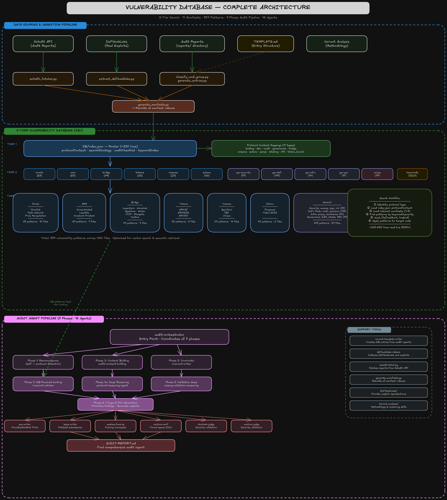

# Vulnerability Database

A curated, agent-optimized vulnerability pattern database for smart contract security audits. Aggregates findings from real-world audits and exploits into structured, searchable entries across EVM, Solana, and Cosmos ecosystems.

## Quick Start

```bash
# Clone the repository
git clone https://github.com/calc1f4r/Vulnerability-database.git
cd Vulnerability-database

# Set up Python environment (for fetching tools)
python3 -m venv .venv
source .venv/bin/activate
pip install -r requirements.txt
```

## Architecture Overview




### Search the Database

Start with `DB/index.json` — the master router that points to the right manifest for any protocol type or keyword:

```
DB/index.json → protocolContext → relevant manifests
DB/manifests/<name>.json → pattern-level index with line ranges
DB/**/*.md → vulnerability content (read only targeted line ranges)
```

See [DB/SEARCH_GUIDE.md](DB/SEARCH_GUIDE.md) for the complete search guide.

### Fetch New Reports

```bash
source .venv/bin/activate
python3 solodit_fetcher.py --keyword "<topic>" --output ./reports/<topic>_findings
```

## Repository Structure

```
├── DB/                              # Vulnerability database
│   ├── index.json                   # Master router — start here
│   ├── SEARCH_GUIDE.md              # Detailed search guide
│   ├── manifests/                   # Pattern-level indexes (11 manifests)
│   ├── oracle/                      # Oracle vulnerabilities (Chainlink, Pyth)
│   ├── amm/                         # AMM vulnerabilities
│   ├── bridge/                      # Cross-chain bridge vulnerabilities
│   ├── tokens/                      # Token standard vulnerabilities
│   ├── cosmos/                      # Cosmos SDK / IBC vulnerabilities
│   ├── Solona-chain-specific/       # Solana program vulnerabilities
│   ├── general/                     # General security patterns
│   └── unique/                      # Protocol-specific unique exploits
├── reports/                         # Raw audit findings (source data)
├── DeFiHackLabs/                    # Real-world exploit PoCs (submodule)
├── Variant-analysis/                # Semgrep/CodeQL detection templates
├── .github/agents/                  # AI agent skill definitions
├── TEMPLATE.md                      # Canonical entry structure
├── Example.md                       # Reference implementation
├── CONTRIBUTING.md                  # Contribution guidelines
└── Agents.md                        # Agent guidance document
```

## 3-Tier Search Architecture

| Tier | File | Purpose |
|------|------|---------|
| 1 | `DB/index.json` | Lean router (~330 lines) — maps protocol types and keywords to manifests |
| 2 | `DB/manifests/*.json` | Pattern-level indexes with line ranges (11 manifests, 500+ patterns) |
| 3 | `DB/**/*.md` | Vulnerability content — read ONLY targeted line ranges from manifests |

### Available Manifests

| Manifest | Patterns | Focus |
|----------|----------|-------|
| `oracle` | 39 | Chainlink, Pyth, price manipulation |
| `amm` | 65 | Concentrated liquidity, constant product |
| `bridge` | 32 | LayerZero, Wormhole, Hyperlane |
| `tokens` | 33 | ERC20, ERC4626, ERC721 |
| `cosmos` | 26 | Cosmos SDK, IBC, staking |
| `solana` | 38 | Solana programs, Token-2022 |
| `general-security` | 31 | Access control, signatures, validation |
| `general-defi` | 115 | Flash loans, vaults, precision |
| `general-infrastructure` | 41 | Proxies, reentrancy, storage |
| `general-governance` | 56 | Governance, stablecoins, MEV |
| `unique` | 59 | Protocol-specific unique exploits |

## AI Agent Ecosystem

Nine specialized agents in `.github/agents/` cover the full audit lifecycle:

| Agent | Purpose |
|-------|---------|
| `audit-context-building` | Deep, line-by-line codebase comprehension |
| `invariant-catcher-agent` | Hunts for known vulnerability patterns using the DB |
| `variant-template-writer` | Synthesizes audit reports into DB entries |
| `defihacklabs-indexer` | Indexes real-world exploit PoCs into DB entries |
| `solodit-fetching` | Fetches raw findings from Solodit API |
| `missing-validation-reasoning` | Specialized input validation auditor |
| `poc-writing` | Writes honest, compilable exploit PoCs |
| `cantina-judge` | Validates findings against Cantina standards |
| `sherlock-judging` | Validates findings against Sherlock standards |

## Creating New Entries

1. Fetch source reports: use `solodit-fetching` agent or `solodit_fetcher.py`
2. Analyze patterns: use `variant-template-writer` or `defihacklabs-indexer` agent
3. Follow [TEMPLATE.md](TEMPLATE.md) structure (see [Example.md](Example.md) for reference)
4. Regenerate manifests: `python3 generate_manifests.py`

## Contributing

See [CONTRIBUTING.md](CONTRIBUTING.md) for guidelines on adding vulnerability entries, improving agents, and maintaining the database.

## License

This project is licensed under the MIT License — see [LICENSE](LICENSE) for details.
