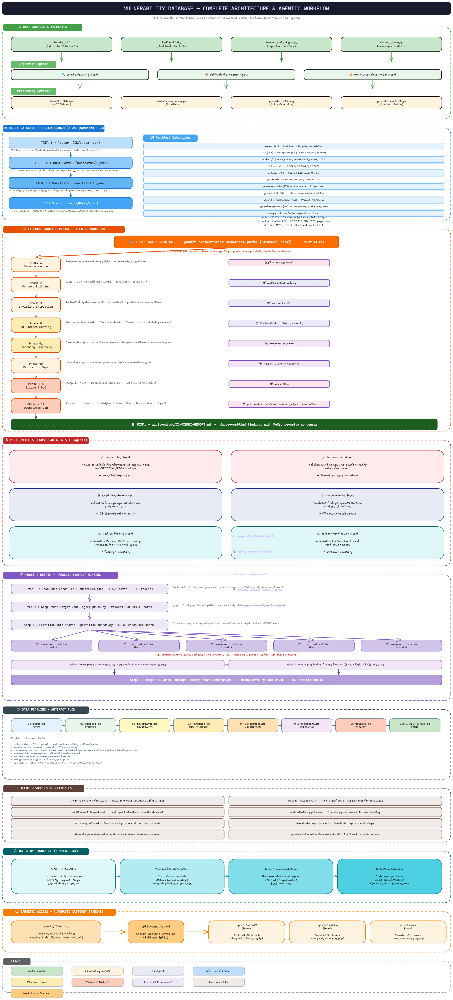

<div align="center">

# Vulnerability Database

**A production-grade, agent-optimized vulnerability pattern database for smart contract security auditing.**

2,258 vulnerability patterns from real-world audits and on-chain exploits, structured into a tiered search system built for LLM-powered audit agents — spanning EVM, Solana, Cosmos, Sui Move, and ZK Rollup ecosystems.

[](LICENSE)
[](DB/manifests)
[](DB/manifests)
[](DB/manifests/huntcards)
[](.github/agents)
[](reports)

</div>

---

## Overview

The Vulnerability Database is a curated knowledge base purpose-built for AI-assisted smart contract auditing. Rather than storing flat lists of findings, it uses a **4-tier precision architecture** that lets agents load only the context they need — reducing token usage by 60–80% compared to naive full-file reads.

The database ships with a **35-agent audit pipeline** that can take an unfamiliar codebase from zero to a triaged report with PoCs, fuzzing harnesses, formal verification specs, and multi-platform severity validation — all powered by the patterns stored here.

### Key Numbers

| Metric | Count |
|--------|-------|
| Vulnerability patterns | 2,258 |
| Hunt cards (compressed detection cards) | 1,522 |
| Manifests (category indexes) | 14 |
| DB content files | 218 |
| Raw source reports | 22,200+ |
| Specialized audit agents | 35 |
| Supported ecosystems | EVM, Solana, Cosmos, Sui Move, ZK Rollups |

---

## Architecture

<div align="center">

<br>
<em>Full architecture: 4-tier search, 11-phase audit pipeline, 35 agents, parallel fan-out hunting</em>
<br>
<a href="docs/architecture.excalidraw">Open in Excalidraw</a>
</div>

---

## 4-Tier Search Architecture

```
Tier 1    DB/index.json                            ← Lean router. ALWAYS start here.
   ↓
Tier 1.5  DB/manifests/huntcards/all-huntcards.json ← 1,522 compressed detection cards
   ↓                                                   with grep patterns & micro-directives
Tier 2    DB/manifests/<name>.json                  ← Full pattern index with line ranges
   ↓
Tier 3    DB/**/*.md                                ← Vulnerability content.
                                                       Read ONLY targeted line ranges.
```

**Why it matters:** An agent auditing a lending protocol loads ~3 manifests (~2K patterns) instead of reading all 218 files. Hunt cards compress those patterns further into grep-first detection cards, letting agents scan a full codebase in a single pass and only read detailed content for confirmed hits.

### Hunt Cards (Tier 1.5)

Hunt cards are the primary interface for bulk auditing. Each card contains:

| Field | Purpose |
|-------|---------|
| `grep` | Regex pattern to search target code |
| `detect` | One-line description of the root cause |
| `check` | Micro-directives — exact steps to verify on a grep hit |
| `antipattern` | The vulnerable code pattern |
| `securePattern` | The correct implementation |
| `neverPrune` | `true` for CRITICAL patterns that always survive pruning |
| `ref` + `lines` | Pointer to the full `.md` entry for confirmed positives |

---

## Vulnerability Coverage

| Manifest | Patterns | Files | Focus |
|---|---|---|---|
| `general-defi` | 438 | 46 | Flash loans, vaults, slippage, precision, calculations, yield |
| `cosmos` | 416 | 43 | Cosmos SDK, IBC, staking, CometBFT, app-chain invariants |
| `sui-move` | 304 | 16 | Sui Move object model, access control, DeFi logic, bridges |
| `general-security` | 153 | 15 | Access control, signatures, input validation, initialization |
| `amm` | 148 | 9 | Concentrated liquidity, constant product, sandwich attacks |
| `general-infrastructure` | 142 | 14 | Proxies, reentrancy, storage collision, upgrades |
| `unique` | 121 | 21 | Protocol-specific exploits from real-world incidents |
| `general-governance` | 118 | 13 | DAOs, stablecoins, MEV, randomness, malicious patterns |
| `oracle` | 107 | 12 | Chainlink, Pyth, price manipulation, staleness |
| `zk-rollup` | 100 | 10 | Circuit constraints, fraud proofs, sequencer, L1-L2 messaging |
| `bridge` | 92 | 10 | LayerZero, Wormhole, Hyperlane, CCIP, Axelar, Stargate |
| `solana` | 68 | 2 | Solana programs, Anchor, Token-2022, SPL |
| `tokens` | 47 | 3 | ERC20, ERC4626, ERC721, token compatibility |
| `account-abstraction` | 4 | 4 | ERC-4337, ERC-7579, paymasters, session keys |
| **Total** | **2,258** | **218** | |

---

## Protocol-to-Manifest Routing

The `protocolContext` section of `DB/index.json` maps protocol types to the manifests an agent should load. This eliminates guesswork and ensures relevant coverage.

| Auditing | Load These Manifests |
|---|---|
| Lending / Borrowing | `oracle`, `general-defi`, `tokens`, `general-security` |
| DEX / AMM | `amm`, `general-defi`, `oracle` |
| Vaults / Yield (ERC4626) | `tokens`, `general-defi`, `general-infrastructure` |
| Governance / DAO | `general-governance`, `general-security` |
| Cross-chain Bridges | `bridge`, `general-infrastructure`, `general-security` |
| Cosmos App-chains | `cosmos`, `general-security` |
| Solana Programs | `solana`, `general-security` |
| Sui Move Contracts | `sui-move`, `general-security` |
| Perpetuals / Derivatives | `oracle`, `general-defi`, `amm` |
| Staking / Liquid Staking | `tokens`, `general-defi`, `general-governance` |
| ZK Rollups | `zk-rollup`, `general-infrastructure`, `general-security` |
| Token Launches | `tokens`, `general-defi`, `general-governance` |

---

## Agent Ecosystem

The `.github/agents/` directory contains **35 specialized agents** organized into a multi-phase audit pipeline with parallel execution, multi-persona reasoning, and downstream formal verification.

### Entry Point

```
@audit-orchestrator <codebase-path> [protocol-hint]
```

### Pipeline

```
Phase 1  Reconnaissance        → Protocol detection, scope, manifest resolution
Phase 2  Context Building      → audit-context-building → function-analyzer (per contract)
                                  → system-synthesizer (global context)
Phase 3  Invariant Extraction  → invariant-writer → invariant-reviewer
Phase 4  DB-Powered Hunting    → N × invariant-catcher (parallel shards)
Phase 4a Reasoning Discovery   → protocol-reasoning (domain decomposition + sub-agents)
         Multi-Persona Audit   → multi-persona-orchestrator
                                  → 6 parallel personas (BFS, DFS, Working Backward,
                                     State Machine, Mirror, Re-Implementation)
Phase 5  Validation Gaps       → missing-validation-reasoning
Phase 6  Triage & PoC          → poc-writing → issue-writer
Phase 7  Downstream Generation → medusa-fuzzing, certora-verification, halmos-verification,
                                  certora-sui-move-verification, sui-prover-verification
         Severity Validation   → sherlock-judging, cantina-judge, code4rena-judge
```

### Agent Reference

<details>
<summary><strong>Orchestration & Context (5 agents)</strong></summary>

| Agent | Role |
|---|---|
| `audit-orchestrator` | Entry point — orchestrates the full 7-phase pipeline |
| `audit-context-building` | Coordinates per-contract analysis; spawns function-analyzer + system-synthesizer |
| `function-analyzer` | Ultra-granular line-by-line function analysis for a single contract |
| `system-synthesizer` | Synthesizes per-contract outputs into a unified global context document |
| `db-quality-monitor` | Monitors 4-tier architecture integrity, manifest health, and auto-remediates |

</details>

<details>
<summary><strong>Invariant & Property Extraction (3 agents)</strong></summary>

| Agent | Role |
|---|---|
| `invariant-writer` | Dual-mode extraction: "What Should Happen" + "What Must Never Happen" |
| `invariant-reviewer` | Reviews and hardens invariants for formal verification readiness |
| `invariant-indexer` | Indexes canonical invariants from production DeFi protocols |

</details>

<details>
<summary><strong>Vulnerability Hunting (4 agents)</strong></summary>

| Agent | Role |
|---|---|
| `invariant-catcher` | Hunts DB patterns against target code in parallel shards |
| `protocol-reasoning` | Deep reasoning-based discovery with domain decomposition |
| `missing-validation-reasoning` | Input validation and hygiene scanner |
| `multi-persona-orchestrator` | Coordinates 6 parallel auditing personas with cross-verification |

</details>

<details>
<summary><strong>Multi-Persona Auditors (6 agents)</strong></summary>

| Agent | Approach |
|---|---|
| `persona-bfs` | Maps entry points, then progressively deepens |
| `persona-dfs` | Verifies leaf functions, then works upward |
| `persona-working-backward` | Traces from critical sinks to attacker-controllable sources |
| `persona-state-machine` | Maps all protocol states and transitions for illegal paths |
| `persona-mirror` | Analyzes paired/opposite functions for asymmetries |
| `persona-reimplementer` | Re-implements functions hypothetically, then diffs |

</details>

<details>
<summary><strong>Output & Reporting (4 agents)</strong></summary>

| Agent | Role |
|---|---|
| `poc-writing` | Writes compilable exploit tests (Foundry, Hardhat, Anchor, etc.) |
| `issue-writer` | Polishes findings into submission-ready write-ups |
| `report-aggregator` | Assembles judge-verified findings into final Sherlock-format report |
| `variant-template-writer` | Converts audit reports into TEMPLATE.md-compliant DB entries |

</details>

<details>
<summary><strong>Formal Verification (6 agents)</strong></summary>

| Agent | Role |
|---|---|
| `chimera-setup` | Scaffolds multi-tool property testing suite (Echidna + Medusa + Halmos) |
| `medusa-fuzzing` | Generates Medusa-compatible property test harnesses |
| `certora-verification` | Generates Certora CVL formal specs + Gambit mutation configs |
| `certora-mutation-testing` | Mutation campaigns with Gambit + certoraMutate |
| `halmos-verification` | Generates Halmos symbolic test suites for Foundry |
| `certora-sui-move-verification` | Generates Certora CVLM specs for Sui Move |
| `sui-prover-verification` | Generates Asymptotic Sui Prover specs for Sui Move |

</details>

<details>
<summary><strong>Severity Validation (4 agents)</strong></summary>

| Agent | Role |
|---|---|
| `judge-orchestrator` | Cross-platform consensus — runs all 3 judges in parallel |
| `sherlock-judging` | Validates findings against Sherlock audit platform criteria |
| `cantina-judge` | Validates findings against Cantina severity matrix |
| `code4rena-judge` | Validates findings against Code4rena competition standards |

</details>

<details>
<summary><strong>Data Collection (2 agents)</strong></summary>

| Agent | Role |
|---|---|
| `solodit-fetching` | Fetches raw findings from the Solodit/Cyfrin API |
| `defihacklabs-indexer` | Indexes DeFiHackLabs exploit PoCs into attack-graph-aware DB entries |

</details>

---

## Searching the Database

### By Protocol Type (Most Common)

```
1. Read DB/index.json → protocolContext.mappings.<protocol_type>
2. Load the listed manifests (1-3 typically)
3. Browse patterns by title / severity / codeKeywords
4. Read targeted line ranges from the .md files
```

### By Keyword

```
1. Read DB/manifests/keywords.json → find your keyword
2. Follow the pointer to the relevant manifest
3. Find the pattern entry → read only lineStart–lineEnd
```

### Bulk Audit (Recommended for Full Audits)

```
1. Load DB/manifests/huntcards/all-huntcards.json (1,522 cards, ~15K tokens)
2. grep target code for each card.grep pattern
3. Cards with neverPrune: true always survive regardless of grep hits
4. Prune cards with zero hits → typically removes 60-80%
5. Partition surviving cards into shards of 50-80
6. Spawn one invariant-catcher sub-agent per shard (parallel)
7. Merge shard findings → deduplicate by root cause
```

---

## Repository Structure

```
Vulnerability-database/
├── DB/                               # Vulnerability database (218 files, 2,258 patterns)
│   ├── index.json                    #   Master router — START HERE
│   ├── SEARCH_GUIDE.md               #   Detailed agent search guide
│   ├── manifests/                    #   14 pattern-level indexes + keywords
│   │   ├── huntcards/                    #   1,522 compressed detection cards
│   │   │   ├── all-huntcards.json    #     All cards in one file
│   │   │   └── *-huntcards.json      #     Per-manifest cards (15 files)
│   │   ├── *.json                    #     Category manifests with line ranges
│   │   └── keywords.json             #     Keyword → manifest routing
│   ├── oracle/                       #   Chainlink, Pyth, price manipulation
│   ├── amm/                          #   Concentrated liquidity, constant product
│   ├── bridge/                       #   LayerZero, Wormhole, Hyperlane, CCIP, Axelar
│   ├── tokens/                       #   ERC20, ERC4626, ERC721
│   ├── cosmos/                       #   Cosmos SDK, IBC, CometBFT, app-chains
│   ├── Solana-chain-specific/        #   Solana programs, Token-2022
│   ├── Sui-Move-specific/            #   Sui Move object model, DeFi, bridges
│   ├── account-abstraction/          #   ERC-4337, ERC-7579, paymasters
│   ├── zk-rollup/                    #   ZK circuits, fraud proofs, sequencers
│   ├── general/                      #   Access control, reentrancy, proxies, DeFi, governance
│   └── unique/                       #   Protocol-specific real-world exploits
│
├── reports/                          # 22,200+ raw audit findings (49 categories)
├── DeFiHackLabs/                     # Real-world exploit PoCs (submodule)
├── scripts/                          # Automation and utility scripts (15 files)
│
├── .github/agents/                   # 35 specialized audit agents
│   └── resources/                    #   Agent reference materials (39 files)
│
├── TEMPLATE.md                       # Canonical DB entry structure
├── Example.md                        # Reference implementation of an entry
├── docs/
│   ├── architecture.png               #   Architecture diagram (PNG)
│   ├── architecture.excalidraw        #   Architecture diagram (editable)
│   ├── db-guide.md                    #   DB entry conventions & search workflows
│   └── codebase-structure.md          #   Detailed codebase structure reference
├── CONTRIBUTING.md                   # Contribution guidelines
└── generate_manifests.py             # Regenerates manifests + hunt cards
```

---

## Targeted Access via Category Branches

Raw reports are split into per-category Git branches by a GitHub Actions workflow, so agents and users can clone exactly the data they need without pulling the full 22K+ report corpus.

```bash
# Clone a single report category
git clone -b reports/<topic> --single-branch \
  https://github.com/calc1f4r/Vulnerability-database.git

# Example: ERC4626 vault reports only
git clone -b reports/erc4626 --single-branch \
  https://github.com/calc1f4r/Vulnerability-database.git
```

See [docs/codebase-structure.md](docs/codebase-structure.md) for the full branch-to-category mapping and report fetch methods.

---

## Install as a Claude Code Plugin

This repository is a native [Claude Code plugin](https://code.claude.com/docs/en/plugins). Install it to get all 35 agents directly accessible via the `/vulnerability-db-agents:` namespace.

### Prerequisites

- [Claude Code](https://code.claude.com/docs/en/quickstart) v1.0.33+
- Git

### Option 1: Clone + Load

```bash
# Clone the repository
git clone https://github.com/calc1f4r/Vulnerability-database.git

# Launch Claude Code with the plugin loaded
claude --plugin-dir ./Vulnerability-database
```

### Option 2: Load from an Existing Claude Code Session

If you already have the repo cloned, load it on-the-fly:

```
/plugin install /path/to/Vulnerability-database
```

### Using Skills

Once the plugin is loaded, all skills are namespaced under `vulnerability-db-agents:`:

```bash
# Run a full audit
/vulnerability-db-agents:audit-orchestrator /path/to/contracts lending_protocol

# Hunt for known vulnerability patterns
/vulnerability-db-agents:invariant-catcher /path/to/contracts

# Write a PoC for a finding
/vulnerability-db-agents:poc-writing <finding-description>

# Validate a finding against Sherlock criteria
/vulnerability-db-agents:sherlock-judging <finding-file>

# Generate Medusa fuzzing harnesses
/vulnerability-db-agents:medusa-fuzzing <invariants-file>

# Fetch reports from Solodit
/vulnerability-db-agents:solodit-fetching <topic>
```

### Using Agents

Agents are available in `/agents` and Claude can invoke them automatically:

```bash
# List all available agents
/agents

# Invoke an agent directly
/agent audit-orchestrator /path/to/contracts
```

### All Available Skills

| Skill | Category | Description |
|---|---|---|
| `audit-orchestrator` | Orchestration | Entry point — 11-phase audit pipeline with 20+ sub-agents |
| `audit-context-building` | Orchestration | Deep line-by-line codebase analysis coordinator |
| `db-quality-monitor` | Orchestration | Monitors 4-tier architecture integrity and auto-remediates |
| `invariant-writer` | Invariants | Dual-mode invariant extraction: positive + adversarial |
| `invariant-reviewer` | Invariants | Reviews and hardens invariants for FV readiness |
| `invariant-indexer` | Invariants | Indexes canonical invariants from production DeFi protocols |
| `invariant-catcher` | Hunting | DB-powered vulnerability pattern hunting in parallel shards |
| `protocol-reasoning` | Hunting | Deep reasoning-based vulnerability discovery |
| `missing-validation-reasoning` | Hunting | Input validation and hygiene scanner |
| `multi-persona-orchestrator` | Hunting | 6 parallel auditing personas with cross-verification |
| `poc-writing` | Output | Writes compilable exploit tests (Foundry, Hardhat, Anchor, etc.) |
| `issue-writer` | Output | Polishes findings into submission-ready write-ups |
| `variant-template-writer` | Output | Converts audit reports into DB entries |
| `medusa-fuzzing` | Verification | Generates Medusa property test harnesses |
| `certora-verification` | Verification | Generates Certora CVL formal specs |
| `halmos-verification` | Verification | Generates Halmos symbolic test suites |
| `certora-sui-move-verification` | Verification | Generates Certora CVLM specs for Sui Move |
| `sui-prover-verification` | Verification | Generates Sui Prover specs for Sui Move |
| `sherlock-judging` | Judging | Validates findings against Sherlock criteria |
| `cantina-judge` | Judging | Validates findings against Cantina criteria |
| `code4rena-judge` | Judging | Validates findings against Code4rena criteria |
| `judge-orchestrator` | Judging | Cross-platform consensus — runs all 3 judges in parallel |
| `report-aggregator` | Output | Assembles judge-verified findings into final report |
| `chimera-setup` | Verification | Scaffolds multi-tool property testing (Echidna + Medusa + Halmos) |
| `certora-mutation-testing` | Verification | Mutation campaigns with Gambit + certoraMutate |
| `defihacklabs-indexer` | Data | Indexes DeFiHackLabs exploit PoCs into DB entries |
| `solodit-fetching` | Data | Fetches raw findings from Solodit/Cyfrin API |

### Plugin Structure

```
Vulnerability-database/              ← Plugin root
├── .claude-plugin/
│   └── plugin.json                  ← Plugin manifest (name, version, description)
├── .claude/
│   ├── agents/                      ← 35 agent definitions
│   ├── skills/                      ← 35 matching skill wrappers
│   ├── resources/                   ← 39 shared reference files
│   └── rules/                       ← 13 path-scoped rules
├── settings.json                    ← Default settings (activates audit-orchestrator)
├── DB/                              ← Vulnerability database (2,258 patterns)
└── README.md
```

### Updating

```bash
cd /path/to/Vulnerability-database && git pull
```

### Developing / Testing Locally

```bash
# Load your local clone during development
claude --plugin-dir ./Vulnerability-database

# Reload after making changes (inside Claude Code)
/reload-plugins

# Debug plugin loading
claude --debug --plugin-dir ./Vulnerability-database
```

---

## Getting Started

### Adding New Entries

```bash
# 1. Fetch raw findings from Solodit
python3 scripts/solodit_fetcher.py --keyword "<topic>" --output ./reports/<topic>_findings/

# 2. Use variant-template-writer agent to synthesize findings into DB entries
@variant-template-writer <topic>

# 3. Regenerate all manifests and hunt cards
python3 generate_manifests.py
```

### Running a Full Audit

```bash
# Point the orchestrator at any smart contract codebase
@audit-orchestrator /path/to/contracts [lending_protocol]
```

The orchestrator auto-detects the protocol type, resolves the relevant manifests, and runs the full 7-phase pipeline.

---

## Contributing

See [CONTRIBUTING.md](CONTRIBUTING.md) for guidelines on adding vulnerability entries, improving agents, and maintaining database quality.

---

## License

MIT — see [LICENSE](LICENSE) for details.
